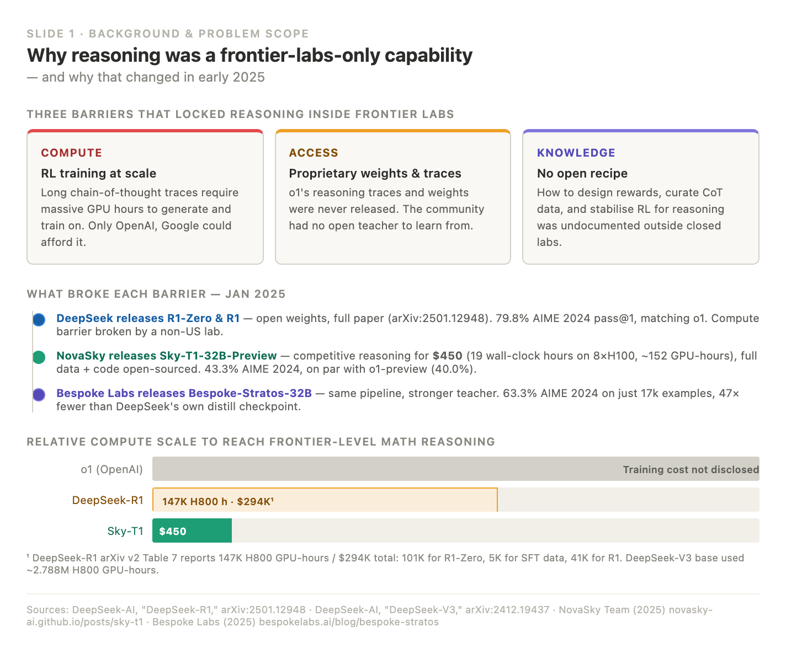
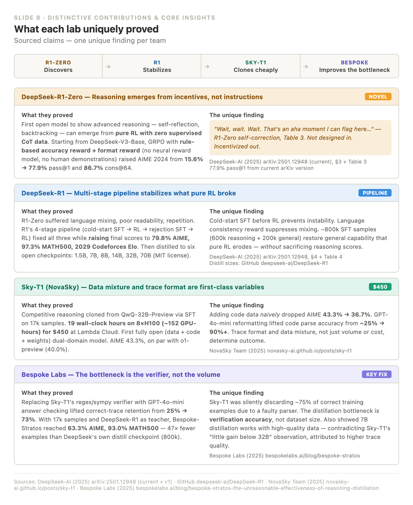
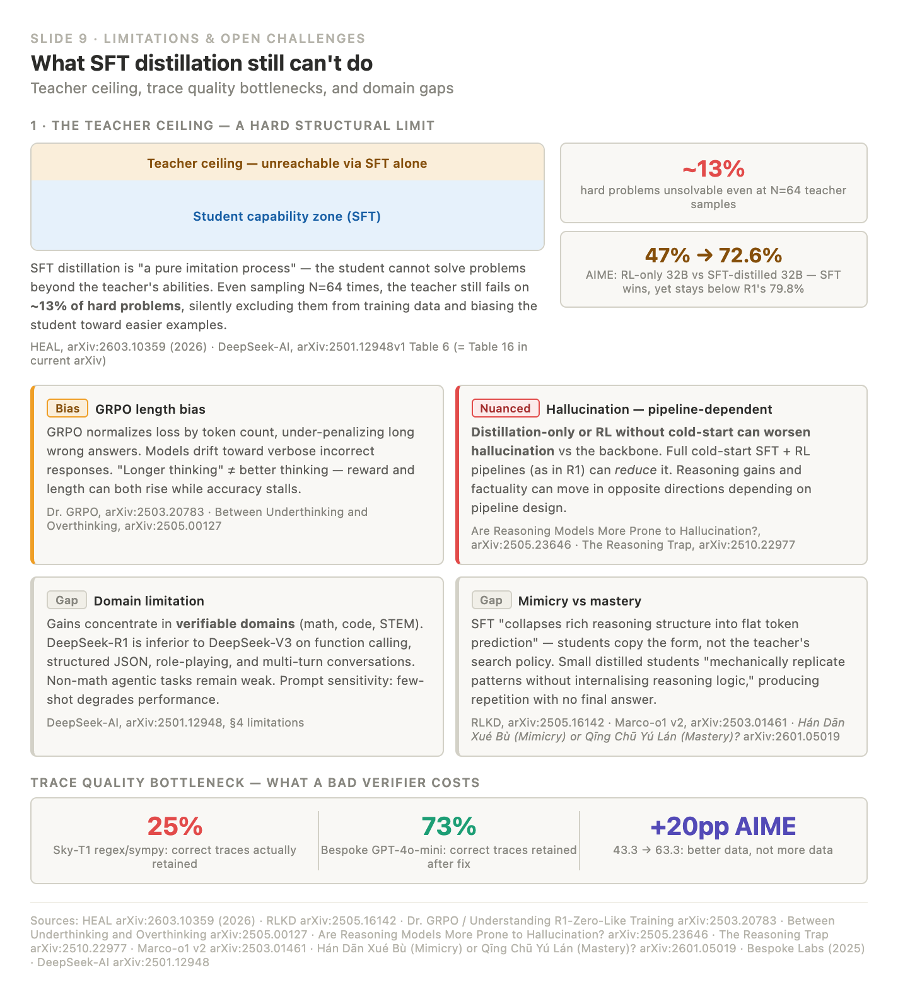
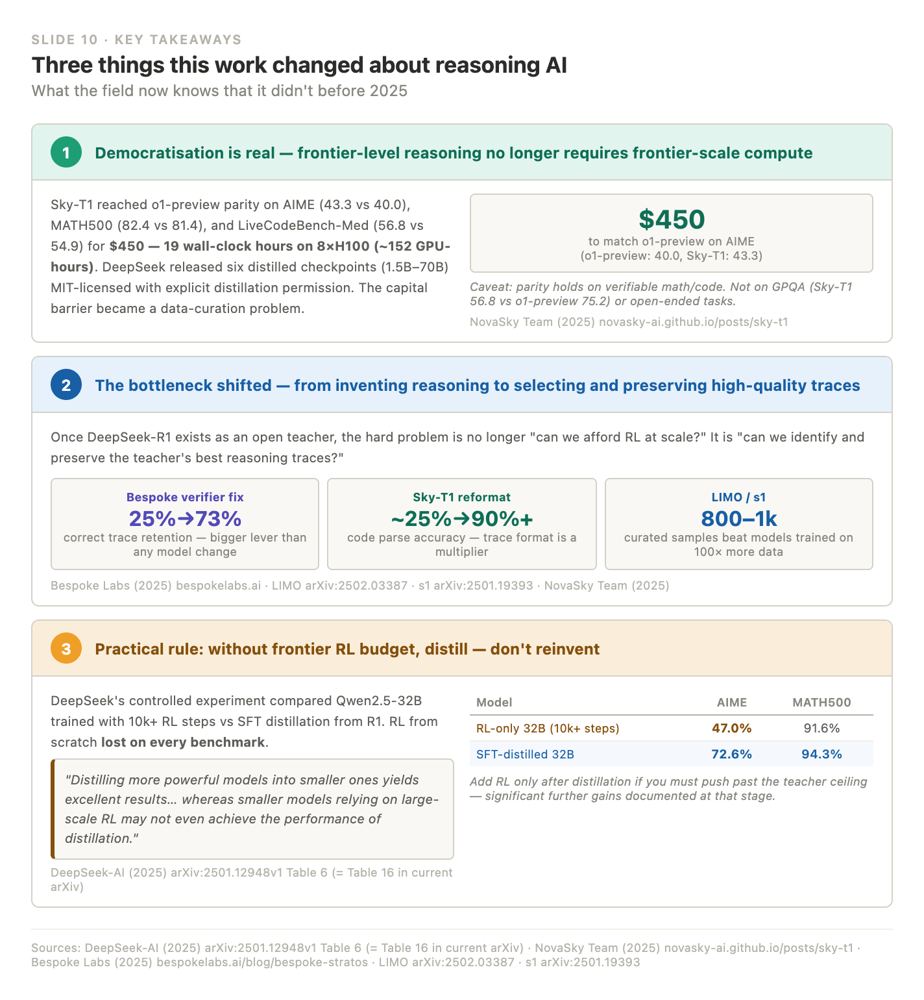

# claude_design

A Claude skill for generating photos and slides that survive being **screenshotted, exported to Canva, or pasted into Figma / Notion**.

## Why HTML

Visuals are built as plain HTML instead of baked images:

- **Editable** — if the AI gets a value wrong, fix it directly in the HTML.
- **No overlap** — text reflows in real layout, so words never collide or clip.
- **Screenshot-safe** — every color is hardcoded hex (no `var(--*)`), so it looks identical outside claude.ai.

## Demo

Slides generated by the skill — each is plain, editable HTML, shown here as screenshots.

| | |
|---|---|
|  |  |
|  |  |

See all ten in [`screenshot-safe-widget/demo/`](screenshot-safe-widget/demo/) ([slide1.html](screenshot-safe-widget/demo/slide1.html) … [slide10.html](screenshot-safe-widget/demo/slide10.html)).

## What's here

- [`screenshot-safe-widget/screenshot-safe-widget.md`](screenshot-safe-widget/screenshot-safe-widget.md) — the skill (themes, rules, palette).
- [`screenshot-safe-widget/demo/`](screenshot-safe-widget/demo/) — example slides (`slide1.html` … `slide10.html`).

## Use it

Ask Claude for a visual you'll capture or export — a slide, table, card, or chart — and pick a theme (**white**, **black**, or custom). Open the resulting `.html` in a browser, tweak any text, then screenshot.

> 💡 **Tip:** writing slide content in English tends to make the skill more successful — non-Latin text (e.g. Chinese) works too, just keep the UTF-8 wrapper.
>
> ⚠️ It sometimes outputs SVG instead of HTML — if that happens, just start a new chat and try again.
